# bond-manager

**Move a live server onto a new switch without dropping it. Fix a bond that
has drifted from reality. Do both over the SSH session that's riding on the
bond you're changing.**

That's the job this was written for.

> **New to bonding, or to this tool?** Read the
> [beginner's guide](docs/GUIDE.md), or just run `sudo bond-manager` and
> follow the menus: every screen explains itself, and **practice mode**
> (press `p`) lets you try anything without changing the server.

<!-- tour-hero:start -->
<!-- generated by make tour: edit the steps and captions in build/tour/capture.py, not here -->
<p align="center">
  
</p>
<p align="center"><sub>Real screens from bond-manager 3.1 on a test server. <a href="#take-the-tour">Take the tour</a> or <a href="https://i0mja.github.io/rhel-bond-manager/">click through it</a>.</sub></p>
<!-- tour-hero:end -->

A rack is being migrated to a new switch. The servers are bonded, they're in
production, and nobody has scheduled an outage — because with bonding you
shouldn't need one. The bond is *designed* to survive losing a leg, so you
move the legs one at a time: bring a NIC up on the new switch, wait for it
to actually join the bond, then and only then retire the leg on the old
switch. The server never notices. You never leave your chair.

That's simple to describe and unforgiving to do by hand at 2am across forty
hosts, because every step has an ordering rule and a way to get it subtly
wrong. `bond-manager` is that procedure, encoded — with a machine that
checks the result and undoes it if you vanish.

---

## Take the tour

<!-- tour-chapters:start -->
<!-- generated by make tour: edit the steps and captions in build/tour/capture.py, not here -->
Every picture below is a real screen, captured from the tool by `make tour`.
Open a chapter to step through it, or use the
[interactive version](https://i0mja.github.io/rhel-bond-manager/), where the arrow keys turn the pages.

<details>
<summary><b>The home screen</b> &middot; What you see the moment you run sudo bond-manager. <i>(3 screens)</i></summary>

**1.** You type `sudo bond-manager`, then press <kbd>Enter</kbd>. The dashboard shows every bond, its ports and their links, which port carries your SSH connection, and how this server can undo a change. bond1 has a problem, and the first reason is explained in plain words.


**2.** You press <kbd>↓</kbd> <kbd>↓</kbd>. Arrow keys move the highlight. A number jumps straight to an item, Enter chooses, q quits. The badge in the corner says LIVE: changes will be real.

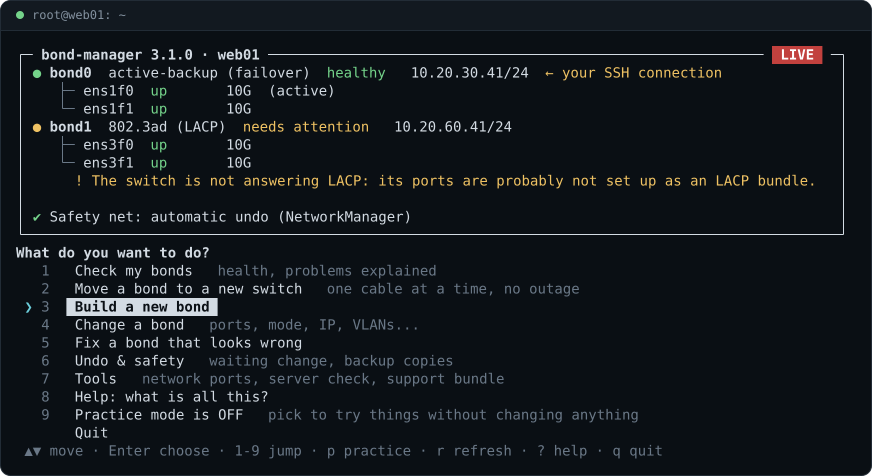

**3.** You press <kbd>p</kbd>. p switches to practice mode. Everything works the same, but at the end you only see the exact plan; nothing on the server changes.

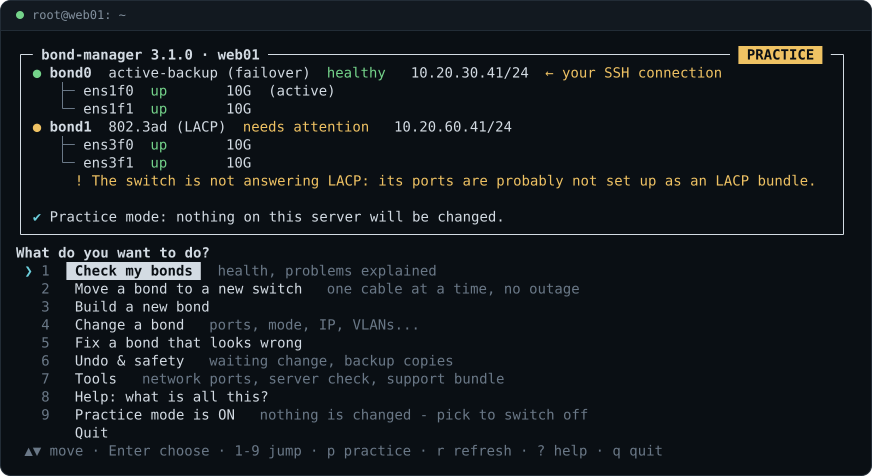

</details>

<details>
<summary><b>Check my bonds</b> &middot; Health, with every problem explained and what to do about it. <i>(3 screens)</i></summary>

**1.** You press <kbd>1</kbd>. Checking is read-only and needs no root.

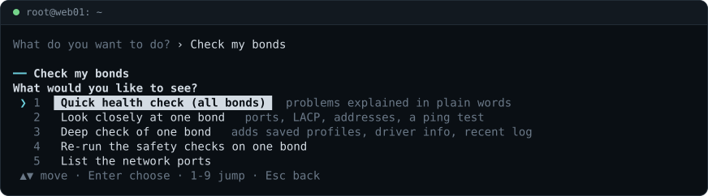

**2.** You press <kbd>Enter</kbd>. Each problem comes with what it means and what to do. Here the switch ports behind bond1 were never set up as an LACP bundle.

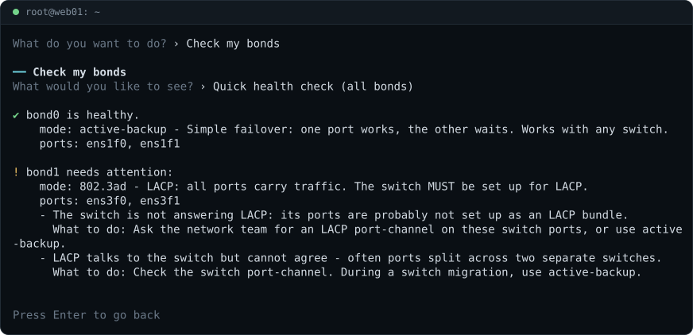

**3.** You press <kbd>5</kbd>. The list of network ports says, for each one, whether you can use it.

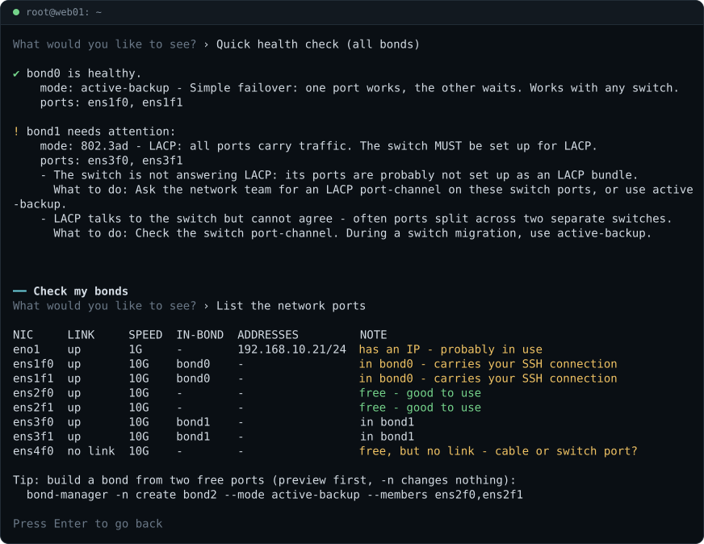

</details>

<details>
<summary><b>Move to a new switch</b> &middot; Swap bond0 onto the new switch one cable at a time, live, with no outage. <i>(9 screens)</i></summary>

**1.** You press <kbd>2</kbd>. The wizard explains the idea first: the new port is added and must really work before the old one is removed.

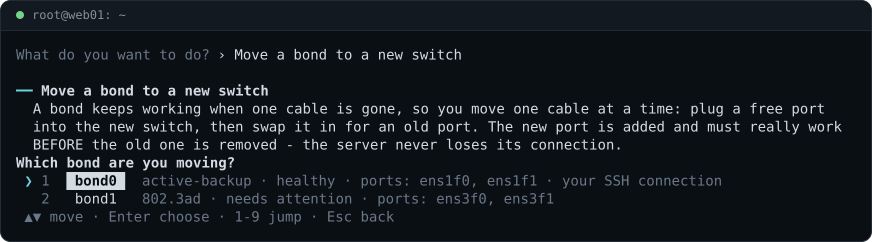

**2.** You press <kbd>Enter</kbd>. Step 1: pick the port whose cable is still on the old switch.

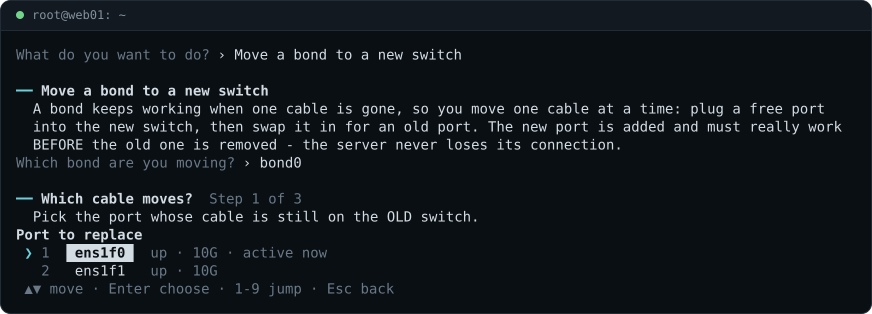

**3.** You press <kbd>Enter</kbd>. Step 2: pick the free port cabled to the new switch. Ports already in a bond are not offered, and risky ones say why (eno1 has an IP, ens4f0 has no link).

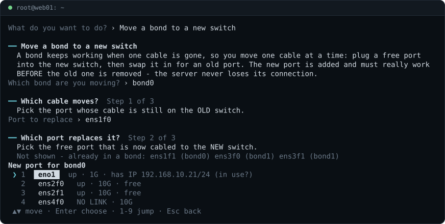

**4.** You press <kbd>2</kbd>. Nothing has happened yet. You pressed 2 for ens2f0. The summary says what will happen in plain words, warns that bond0 carries your SSH session, and shows the same thing as a command you can paste into a runbook.

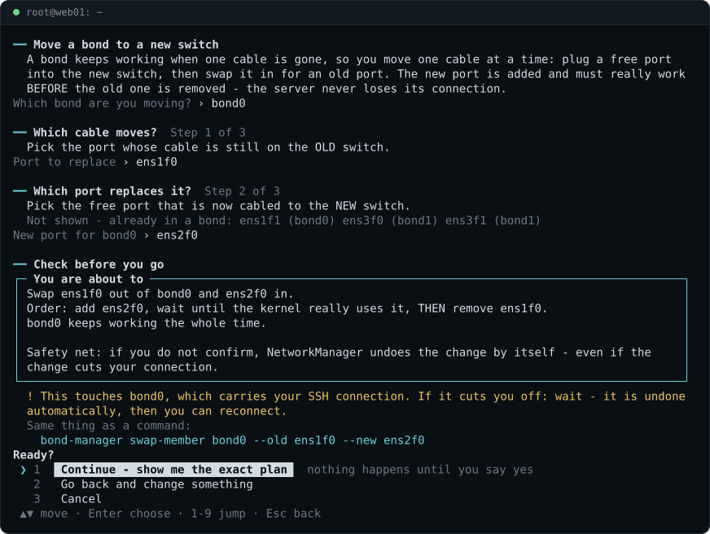

**5.** You press <kbd>Enter</kbd>. The exact nmcli commands, in order. Note step 3: it waits until the kernel really uses ens2f0 before step 4 removes ens1f0.

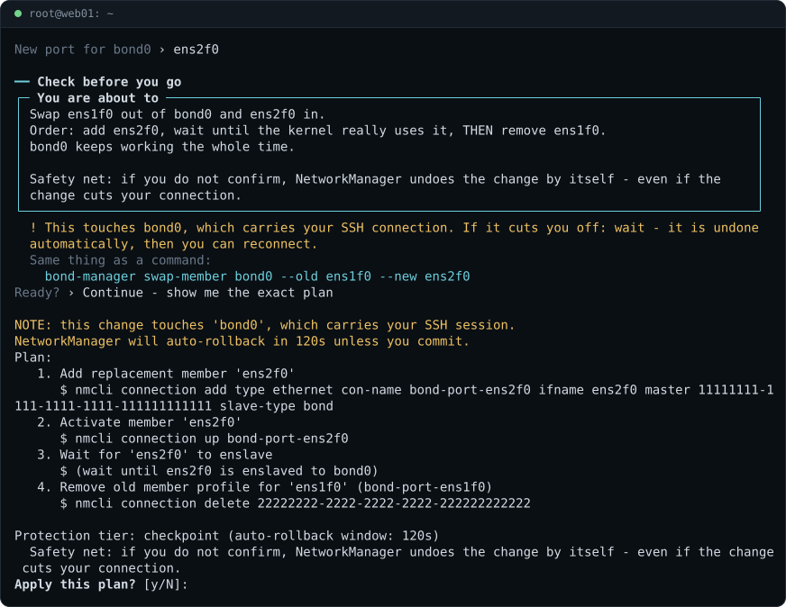

**6.** You press <kbd>y</kbd> <kbd>Enter</kbd>. A backup copy is taken, the safety net is armed, the change runs and is checked against the kernel. Then it waits for you. If the change had cut your connection, doing nothing would undo it.

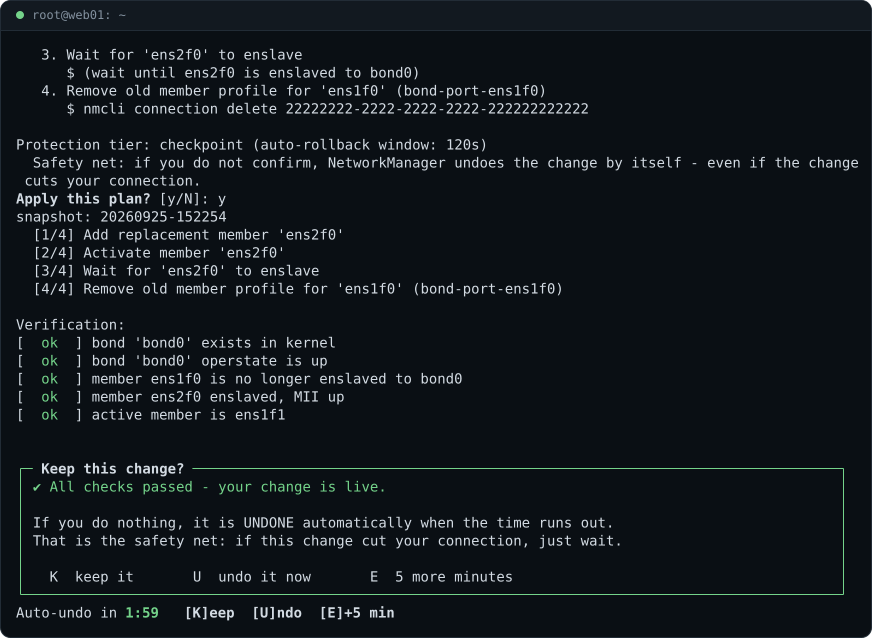

**7.** You press <kbd>K</kbd>. K keeps the change.

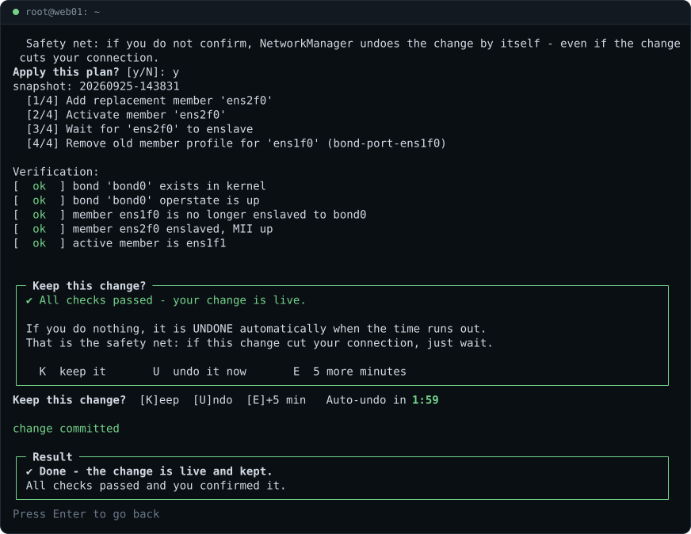

**8.** You press <kbd>Enter</kbd>. Move the other cable too? The wizard offers it straight away.

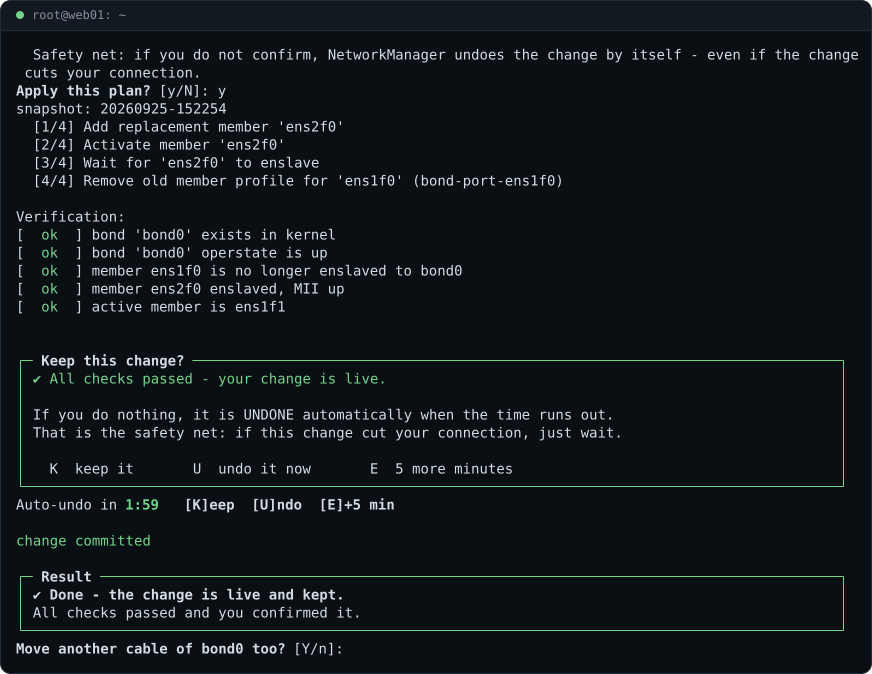

**9.** You press <kbd>n</kbd> <kbd>Enter</kbd>. Back home, the dashboard shows bond0 now running on ens1f1 and ens2f0.

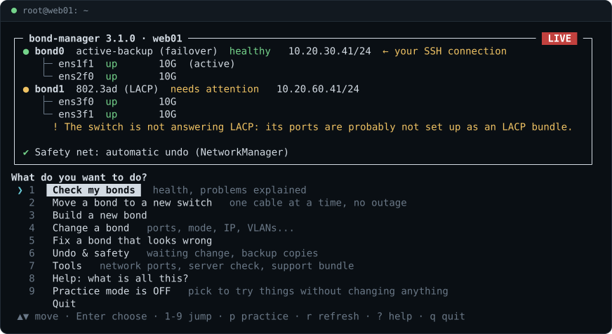

</details>

<details>
<summary><b>Build a new bond</b> &middot; Five short questions, in practice mode: see the plan, change nothing. <i>(6 screens)</i></summary>

**1.** You press <kbd>3</kbd>. Step 1 suggests the next free name. Esc always goes back one step.

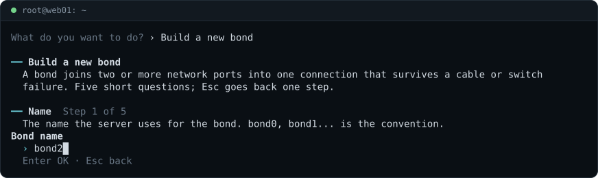

**2.** You press <kbd>Enter</kbd> <kbd>↓</kbd> <kbd>Space</kbd> <kbd>↓</kbd> <kbd>Space</kbd>. Step 2 is a checklist of free ports: link, speed and anything to watch out for (no link, already has an IP).

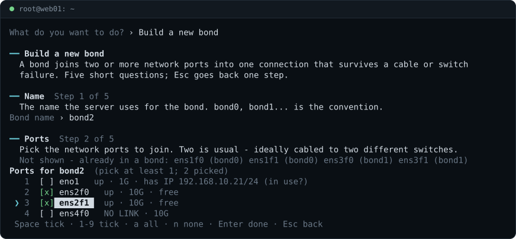

**3.** You press <kbd>Enter</kbd>. Step 3: the safe choice comes first. Picking 802.3ad asks whether the switch is ready for LACP.

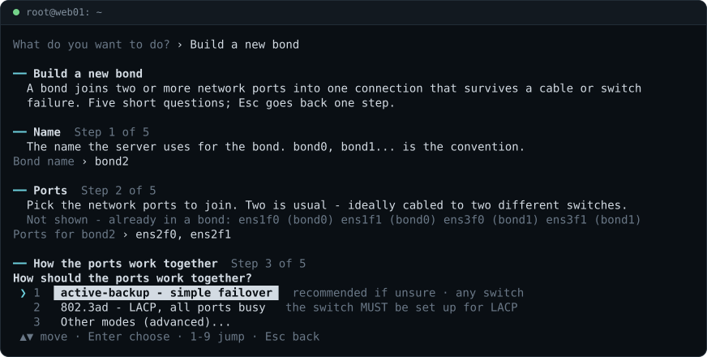

**4.** You press <kbd>2</kbd>, then type `10.20.40.10`, then press <kbd>Enter</kbd>. Step 4: typing mistakes are caught on the spot, with how to fix them.

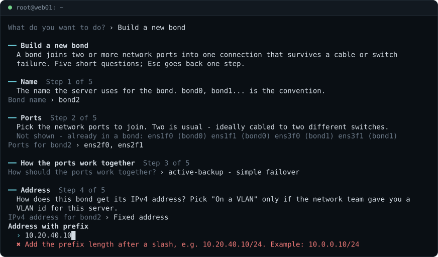

**5.** You type `/24`, then press <kbd>Enter</kbd>, then type `10.20.40.1`, then press <kbd>Enter</kbd> <kbd>Enter</kbd> <kbd>Enter</kbd>. The review in plain words, and the command that does the same thing.

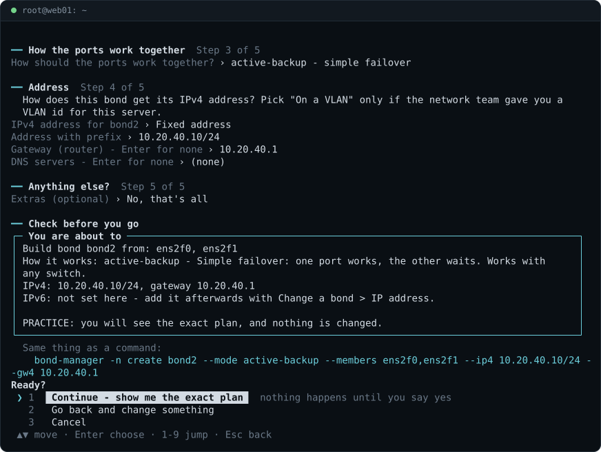

**6.** You press <kbd>Enter</kbd>. In practice mode this is where it stops: the exact plan, and nothing changed.

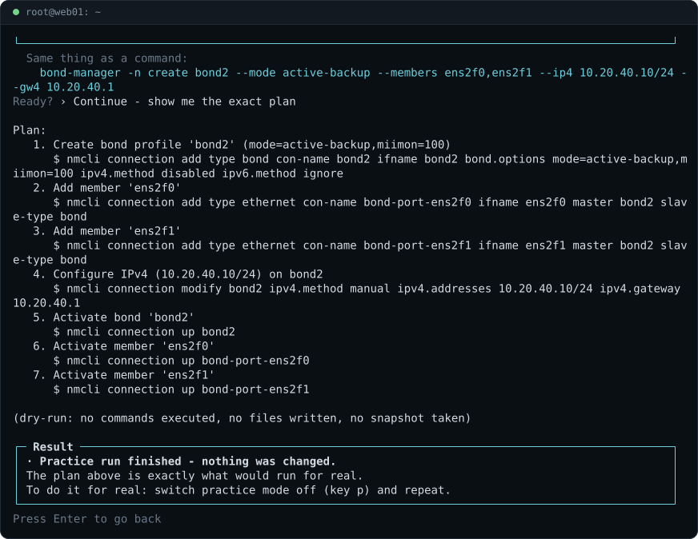

</details>

<details>
<summary><b>A change is waiting</b> &middot; When a session dropped, or you walked away before pressing K. <i>(2 screens)</i></summary>

**1.** You type `sudo bond-manager`, then press <kbd>Enter</kbd>. A banner counts down to the automatic undo, and "Keep or undo" is the first item.

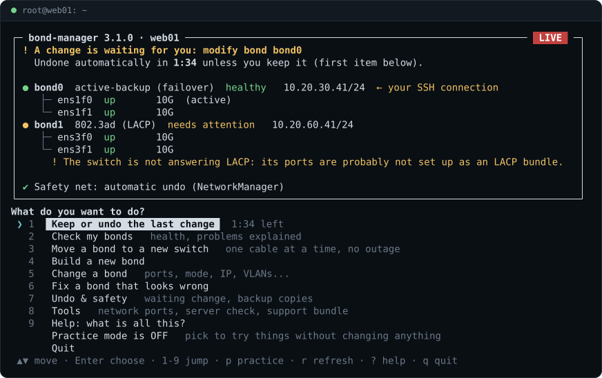

**2.** You press <kbd>Enter</kbd>. Keep it if everything works, or undo it now.

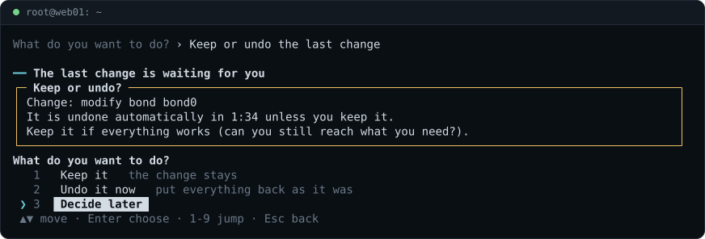

</details>

<details>
<summary><b>Help, in plain words</b> &middot; Nine short topics, written for someone who has never set up a bond. <i>(2 screens)</i></summary>

**1.** You press <kbd>8</kbd>. The same text is available on the command line: bond-manager help TOPIC.

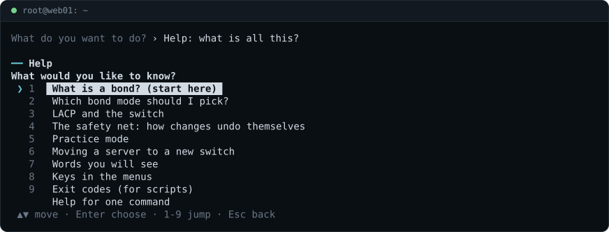

**2.** You press <kbd>2</kbd>. Which mode should I pick? The answer, and what each one asks of the switch.

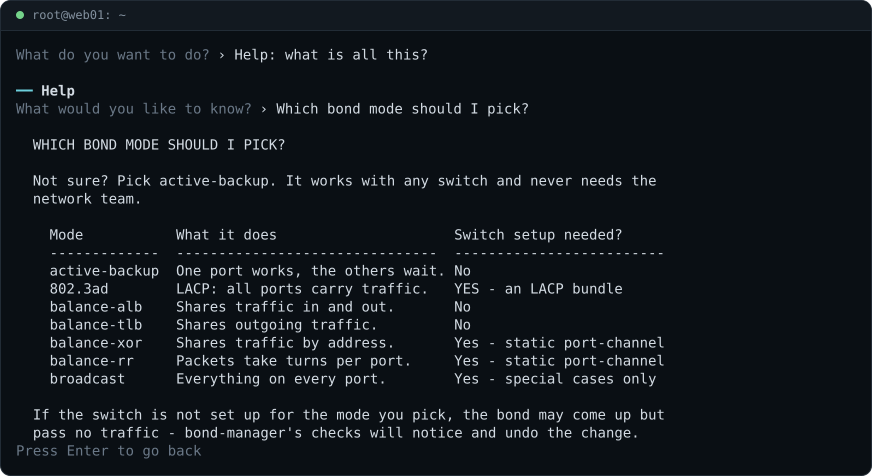

</details>

<details>
<summary><b>On the command line</b> &middot; Every error says what to do next, and every command has help with examples. <i>(4 screens)</i></summary>

**1.** You type `bond-manager nics`, then press <kbd>Enter</kbd>. Which ports can I use? A plain verdict for every port, and a ready-made command.

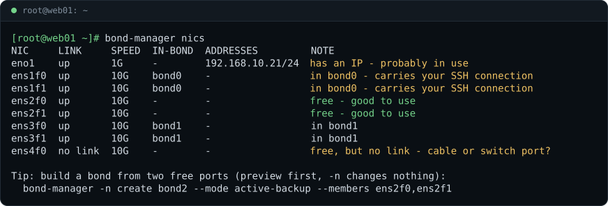

**2.** You type `bond-manager create bond2 active-backup`, then press <kbd>Enter</kbd>. A mode typed without its flag: the ERROR line stays the same for scripts, and the Next step line says what was meant.

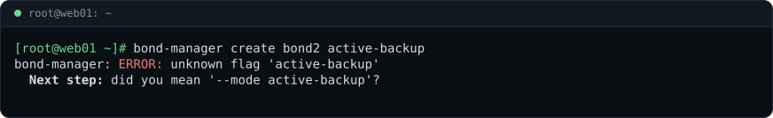

**3.** You type `bond-manager move`, then press <kbd>Enter</kbd>. Unknown commands get a suggestion by meaning, not only by spelling.

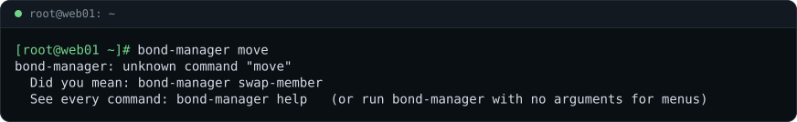

**4.** You type `bond-manager help swap-member`, then press <kbd>Enter</kbd>. Per-command help: plain words, usage, examples that always start with a -n preview.

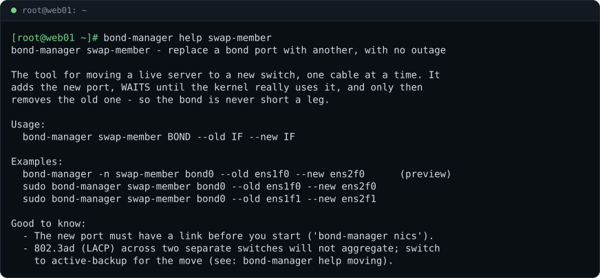

</details>

<details>
<summary><b>Serial consoles</b> &middot; No arrow keys or colors needed: numbered menus, 7-bit ASCII. <i>(1 screen)</i></summary>

**1.** You type `sudo bond-manager --plain`, then press <kbd>Enter</kbd>. The same menus on a serial console, a dumb terminal or with --plain: type the number and press Enter.

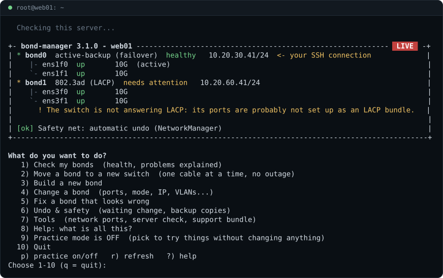

</details>
<!-- tour-chapters:end -->

---

## The two jobs it was built for

### 1. Move a live server to a new switch, one leg at a time

```bash
bond-manager swap-member bond0 --old ens1f0 --new ens2f0
```

That single command adds `ens2f0`, activates it, **waits until the kernel
actually reports it enslaved to `bond0`**, and only then deletes the profile
for `ens1f0`. The bond is never down a leg it hasn't already replaced. Then
you do the other one:

```bash
bond-manager swap-member bond0 --old ens1f1 --new ens2f1
```

Two commands, no outage, and the verification gate confirms both halves
afterwards: the new member is enslaved, the old one is gone.

> **The LACP catch.** If your bond is `802.3ad`, its members must terminate
> in one LAG domain — a single switch, or an MLAG/stacked pair. Mid-migration
> you'd have one leg on the old switch and one on the new, and LACP will
> refuse to aggregate across two independent switches. So either the two
> switches share a LAG domain, or you ride the migration out in
> `active-backup`, which is perfectly happy with a leg on each:
>
> ```bash
> bond-manager modify bond0 --mode active-backup   # drops the now-meaningless
>                                                  # lacp_rate/xmit_hash_policy
> ...migrate both legs...
> bond-manager modify bond0 --mode 802.3ad         # once both are on the new switch
> ```
>
> `diagnose` will tell you when LACP has no partner, which is exactly the
> symptom of a switch side that isn't bundled yet.

### 2. Repair a bond that no longer matches reality

Bonds drift. Someone enslaved a NIC by hand and never wrote a profile. A
half-finished migration left a port profile pointing at a NIC that isn't a
member any more. The kernel says one thing, NetworkManager says another —
and the difference only bites at the next reboot, when NetworkManager wins
and the bond comes back wrong.

```bash
bond-manager repair bond0
```

reconciles the profiles to what the kernel is *actually* doing right now:
creates a port profile for every enslaved member that lacks one, deletes
every port profile whose NIC is no longer a member. `--dry-run` first shows
you exactly which way the drift goes before you commit to a direction.

---

## Why not just run the nmcli by hand?

You can. People do. The commands aren't the hard part — the ordering, the
verification and the recovery are:

- **Order.** Remove the old leg a heartbeat before the new one finishes
  enslaving and you've just dropped the server you're logged into. The gap
  is small, real, and invisible until it isn't.
- **A mode the switch isn't ready for.** LACP against ports with no
  port-channel and the link goes dark. Move a leg to a switch that isn't
  bundled yet and the bond quietly runs on one NIC.
- **Options the kernel ignores.** Set `primary` on a `balance-rr` bond, or
  `lacp_rate` on `active-backup`, and nothing complains — the failover you
  thought you configured was never armed.
- **`nmcli` returning 0 means "the profile was written."** It does not mean
  the bond came up, the members enslaved, or the gateway is reachable.
- **A rollback plan of "I took a tar backup first"** doesn't help when the
  change already cut the session you'd need to restore it from.

Every one of those is survivable — *if the machine can undo the change by
itself once you stop answering.* That single idea drives the whole design.

## What it does about it

### It shows you the future before it happens

`--dry-run` prints the exact `nmcli` commands it would run. Not a summary —
the commands. Paste them into a change ticket, read them in review, or run
them by hand if you'd rather. It needs no root and writes nothing, not even
a log line.

### It arms a dead man's switch

Before anything changes, bond-manager asks NetworkManager for a checkpoint.
If you don't confirm within the window — because the change cut your session
— **NetworkManager rolls it back itself**, server-side, with no help from
you. You reconnect to the machine you started with.

That's the trick that makes migrating a live server survivable, and it's why
this tool exists. On hosts without D-Bus checkpoints it degrades to a
systemd dead-man timer, then to snapshots, and `doctor` tells you which tier
you're getting *before* you need it.

### It checks reality, not intentions

After every change bond-manager reads `/proc/net/bonding`, `/sys/class/net`
and the routing table and asks the questions that matter: is the bond
*actually* up, is the mode what you asked for, are the members *really*
enslaved, did the member you replaced actually leave, does the gateway
answer **through the new interface**?

A failed check rolls the change back on its own. You don't have to notice.

### It won't let you shoot yourself in the foot quietly

It works out which device carries your SSH session — including when that's a
VLAN riding on the bond, and including under `sudo`, which strips
`SSH_CONNECTION` out of the environment. Touching that device without
checkpoint protection takes an explicit `--force-unsafe` and a deliberate
decision, not a shrug.

### It explains itself

The guided menus are there for 2am, when nobody wants to recall flag names
from memory. They ask one plain question at a time. Ports and modes are
picked from lists that say *"free - good to use"* or *"no link - cable or
switch port?"*, and typos are caught while you type. Every change ends with
a summary in plain words and the exact command line it built:

```
Same thing as a command:
  bond-manager swap-member bond0 --old ens1f0 --new ens2f0
```

Click through the first host, paste that into your runbook, script the other
thirty-nine. The menus are a teaching tool that puts itself out of a job.

The command line explains itself too. Every error ends with a *Next step*,
typos get a *did you mean*, and `bond-manager help COMMAND` shows plain
words and copy-paste examples:

```
$ bond-manager create bond1 active-backup
bond-manager: ERROR: unknown flag 'active-backup'
  Next step: did you mean '--mode active-backup'?
```

## The 30-second version

```bash
bond-manager doctor      # can this host protect me? which tier do I get?
bond-manager list        # what have I got, and is it healthy?
bond-manager nics        # which ports are free, which have a link?
bond-manager -n swap-member bond0 --old ens1f0 --new ens2f0
                         # show me the plan; change absolutely nothing
```

Happy with the plan? Drop the `-n`. Watch it snapshot, arm, apply, and
verify — then press `c` to commit, or just walk away and let it undo itself.

## It's one file

No packages, no runtime, no `pip install` on an air-gapped box, no
dependency you have to justify to a change board. Not even whiptail: the
menus are plain bash. `scp` one auditable bash script to `/usr/local/sbin`
and it runs on what RHEL 8/9 already ships. You can read the whole thing.
So can your security team.

*(It's developed as 18 focused modules under `lib/` and compiled into that
single file by `make dist`. The modularity is for us; the single file is for
you.)*

## Is this for you?

**Probably yes if** you run bonded NICs on RHEL-like servers, you re-cable
or re-home them while they're in production, and "just use the console"
isn't a plan you actually have.

**Probably not if** you manage machines exclusively through Ansible or
Ignition and never touch a live host — though `--dry-run`, the JSON output
and the typed exit codes are designed to slot into exactly that world too.

**Definitely not** a replacement for NetworkManager, a switch configuration
tool (the switch side of LACP is still your problem), or a cross-host
orchestrator. It does one thing: make bonding changes on *this* host
survivable.

---

## Under the hood: how a change works

Every mutating command runs as a transaction:

```
plan  →  snapshot  →  arm protection  →  execute  →  verify  →  commit
                                                        │
                                             (failure)  └────→  rollback
```

- The **plan** is rendered before anything runs, as the exact `nmcli`
  commands an operator could type by hand. `--dry-run` renders the plan and
  does nothing else — no root needed, no files written, no snapshot taken.
- A **snapshot** of both NetworkManager profile stores — the keyfile store
  `/etc/NetworkManager/system-connections` and RHEL 8's ifcfg store
  `/etc/sysconfig/network-scripts` — is taken before the first mutating
  step (tar archives plus a sha256 manifest of every file).
- **Protection is armed** before anything changes, at the strongest tier the
  host supports (see below). If you never confirm the change — because the
  change cut your session — it rolls back by itself.
- **Verification** checks kernel state (`/proc/net/bonding`, `/sys/class/net`)
  and the routing table — the ground truth, not what nmcli believes. A
  failed check triggers an automatic rollback (exit code 5); advisory
  checks are reported as warnings and left to your judgement.
- Applying takes real time, so once verification passes the auto-rollback
  window is **re-budgeted to a full window** — you always get the whole
  documented interval to decide, never the remainder of it.
- Only then is the change **committed** (interactively, via `--yes`, or from
  a second session with `bond-manager commit`). If the checkpoint is already
  gone by then, the commit reports exit 5 ("most likely rolled back"), never
  success.

### The three protection tiers

Before each change, bond-manager probes the host and arms the strongest
available tier:

| Tier | Mechanism | When it applies | If you never confirm |
|---|---|---|---|
| 1 `checkpoint` | NetworkManager D-Bus checkpoint (`CheckpointCreate` via `busctl`) | busctl present and NM answers on D-Bus (default on RHEL 8/9) | NM itself reverts device **and** profile state server-side — safe even if the change killed your SSH session |
| 2 `deadman` | Transient systemd timer running `bond-manager rollback --snapshot ID` | No usable NM checkpoint (or `--no-checkpoint`), but `systemd-run` exists | The timer fires at the deadline, restores the snapshot and brings the affected connections up again with it |
| 3 `snapshot` | tar snapshot only | Neither busctl nor systemd-run available | Nothing automatic — rollback is a manual `bond-manager rollback` |

The auto-rollback window defaults to `ROLLBACK_WINDOW=120` seconds
(override per-invocation with `--rollback-window S`). Tier 1 checkpoints are
created with the `DELETE_NEW_CONNECTIONS | DISCONNECT_NEW_DEVICES` flags, so
rolling back genuinely undoes a *create*, not just an edit. `doctor` reports
which tier your host will get.

If a change touches the device your SSH session rides on — the bond itself,
any of its current members, or any of its VLAN interfaces — the **SSH egress
guard** warns you (tier 1) or refuses to proceed (tiers 2–3, unless you pass
`--force-unsafe`). The guard works under `sudo`: `sudo`'s `env_reset` strips
`SSH_CONNECTION`, so the peer address is taken from `SSH_CLIENT` or from
the `who(1)` login record for the session's terminal when it is missing.
Pending-change state lives in `/run/bond-manager/`, so a **new** SSH session
can `bond-manager commit` or `bond-manager rollback` after a disconnect.
Full details: [docs/SAFETY.md](docs/SAFETY.md).

## Quick start

Install the single-file artifact:

```bash
install -m 0755 bond_manager.sh /usr/local/sbin/bond-manager
```

or from a clone (also installs the man page):

```bash
git clone https://github.com/i0mja/rhel-bond-manager.git
cd rhel-bond-manager
sudo make install        # PREFIX=/usr/local, DESTDIR-aware
```

Then:

```bash
bond-manager doctor          # preflight: tools, NM, protection tier
sudo bond-manager init       # optional: install default config + logrotate policy
sudo bond-manager            # guided menus (on a terminal); press p to practise
bond-manager --help          # common tasks + full CLI reference
bond-manager help basics     # what a bond is, in plain words
```

## CLI reference

```
bond-manager [GLOBAL FLAGS] <command> [ARGS]
```

Global flags: `-n/--dry-run`, `-y/--yes`, `--json`, `--debug`, `--quiet`,
`--no-color` (`NO_COLOR` honored), `--plain`, `--rollback-window S`,
`--no-checkpoint`, `--force-unsafe`, `-V/--version`, `-h/--help`.
`--help` after a command shows that command's help, e.g.
`bond-manager swap-member --help`.

### Read-only commands (no root, write nothing)

| Command | Description |
|---|---|
| `list` | One line per bond: name, mode, health |
| `show BOND` | Full bond detail (`--json` supported) |
| `status [BOND]` | Health summary; exit 0 healthy / 10 degraded / 11 down |
| `diagnose BOND [--extended] [--target IP]` | Kernel state, member detail, LACP partner, reachability |
| `doctor` | Environment preflight + protection-tier report |
| `nics [--all]` | Every network port: link, speed, bond, addresses, and a plain verdict ("free - good to use", "has an IP - probably in use", "carries your SSH connection") |
| `help [COMMAND\|TOPIC]` | Plain-English help with copy-paste examples; topics: `basics modes lacp safety practice moving glossary keys exit-codes` |
| `config show\|path` | Effective configuration / config file path |
| `completion bash` | Emit bash completion script |
| `verify BOND` | Re-run the verification gate against current state; read-only, exit 1 if a check fails |

### Change commands (root; guarded by the transaction engine)

Create an LACP bond with jumbo frames and the IP on a VLAN interface:

```bash
bond-manager create bond0 --mode 802.3ad --members ens1f0,ens1f1 \
    --mtu 9000 --ip4 none \
    --vlan '120:ip4=10.20.30.40/24;gw4=10.20.30.1;dns4=10.20.0.53'
```

Preview it first — `--dry-run` renders the exact plan and touches nothing:

```
$ bond-manager -n create bond0 --mode 802.3ad --members ens1f0,ens1f1 --mtu 9000 --ip4 none --vlan '120:ip4=10.20.30.40/24;gw4=10.20.30.1'
Plan:
   1. Create bond profile 'bond0' (mode=802.3ad,lacp_rate=fast,miimon=100,xmit_hash_policy=layer3+4)
      $ nmcli connection add type bond con-name bond0 ifname bond0 bond.options mode=802.3ad,lacp_rate=fast,miimon=100,xmit_hash_policy=layer3+4 ipv4.method disabled ipv6.method ignore
   2. Set MTU 9000 on bond0
      $ nmcli connection modify bond0 802-3-ethernet.mtu 9000
   3. Add member 'ens1f0'
      $ nmcli connection add type ethernet con-name bond-port-ens1f0 ifname ens1f0 master bond0 slave-type bond
   ...
   6. Create VLAN 120 on bond0 (bond0.120)
      $ nmcli connection add type vlan con-name bond0.120 ifname bond0.120 vlan.parent bond0 vlan.id 120 ipv4.method disabled ipv6.method ignore
   ...
(dry-run: no commands executed, no files written, no snapshot taken)
```

Grow, shrink, and migrate membership:

```bash
bond-manager add-member bond0 ens1f2,ens1f3
bond-manager remove-member bond0 ens1f3
bond-manager swap-member bond0 --old ens1f0 --new ens2f0
```

`swap-member` is the switch-migration workhorse, and its ordering is the
whole point: it adds `ens2f0`, activates it, **waits for the kernel to
report it enslaved**, and only then deletes the profile for `ens1f0` — so
the bond is never short a leg it hasn't already replaced. Verification
afterwards checks both halves (new member in, old member out), and the swap
is rolled back if either is untrue. There is a test asserting the add lands
before the remove, because that ordering is the reason the command exists.

`remove-member` will take the last member out if you ask it to — it warns
first, and verifies with a relaxed expectation, since a memberless bond is
legitimately down rather than broken.

Modify tuning, mode, IP, or MTU on an existing bond (only the diff is planned):

```bash
bond-manager modify bond0 --opt miimon=50 --opt lacp_rate=slow
bond-manager modify bond0 --mode active-backup --opt primary=ens1f0
bond-manager modify bond0 --ip4 10.0.0.10/24 --gw4 10.0.0.1 --dns4 10.0.0.53
bond-manager modify bond0 --del-opt updelay           # delete an option
```

Changing `--mode` **drops the options that only belonged to the old mode**
and says which ones. Taking an 802.3ad bond to `active-backup` — what a
migration across two unbundled switches needs — would otherwise fail on the
`lacp_rate` and `xmit_hash_policy` it is being asked to abandon. Options you
pass in the *same* command are still validated strictly, so
`--mode active-backup --lacp-rate fast` is still rejected as the
contradiction it is.

If the existing profile carries no explicit `mode=` in `bond.options`,
`modify` treats it as `balance-rr` — the kernel/NetworkManager default —
and says so, so the new option set is validated against the mode the bond
actually runs in.

VLANs, cloning, repair, removal:

```bash
bond-manager vlan add bond0 '200:ip4=dhcp'
bond-manager vlan modify bond0 200 --ip4 192.0.2.10/24
bond-manager vlan remove bond0 200
bond-manager vlan list bond0
bond-manager clone bond0 bond1 --members ens2f0,ens2f1 --copy-ip --copy-vlans
bond-manager repair bond0        # rebuild port profiles from kernel state
bond-manager remove bond0        # deletes VLAN + port + bond profiles (asks you
                                 # to type the bond name; --keep-vlans to spare VLANs)
```

Per-mode bond options are validated against a mode/option matrix before
anything runs (e.g. `arp_interval` is rejected for 802.3ad, `primary` is
rejected outside active-backup/tlb/alb, `miimon` and `arp_interval` are
mutually exclusive). Convenience flags map to options: `--miimon`,
`--primary`, `--lacp-rate`, `--xmit-hash`, `--arp-interval`,
`--arp-targets`, `--min-links`. Option values containing commas survive
merging (`--opt arp_ip_target=10.0.0.1,10.0.0.2` stays one option).
`--no-activate` writes the profiles without bringing them up; the change is
then verified with a relaxed expectation, since the bond is legitimately
down afterwards.

IP method flags map to NetworkManager as follows:

| Flag | NetworkManager property |
|---|---|
| `--ip4 dhcp` | `ipv4.method auto` |
| `--ip4 none` | `ipv4.method disabled` |
| `--ip4 CIDR[,CIDR]` | `ipv4.method manual` + `ipv4.addresses` (`--gw4`/`--dns4` when given) |
| `--ip6 auto` | `ipv6.method auto` (SLAAC) |
| `--ip6 dhcp` | `ipv6.method dhcp` — DHCPv6 without SLAAC, a distinct method |
| `--ip6 none` | `ipv6.method ignore` — `disabled` only exists from NetworkManager 1.20, `ignore` means the same thing and works on every supported release |
| `--ip6 CIDR[,CIDR]` | `ipv6.method manual` + `ipv6.addresses` (`--gw6`/`--dns6` when given) |

### What verification decides

After the last step the gate reads kernel state and reports each check as
pass, warn, or FAIL. **Only a FAIL rolls the change back** (exit 5):

| Rolls back (FAIL) | Warns only |
|---|---|
| bond missing from `/proc/net/bonding` | member enslaved but MII status is not `up` |
| bond operstate did not reach `up` within `LINK_SETTLE_TIMEOUT` | 802.3ad: no LACP partner detected |
| mode is not the requested mode | active-backup: no currently-active member reported |
| an expected member is not enslaved | the IP-bearing interface has no address yet (DHCP still negotiating) |
| a member that should be gone is still enslaved | the gateway does not answer ping through the changed interface |

Operations that legitimately leave the bond down are verified with a
relaxed expectation, so a correct change cannot fail its own gate:
`--no-activate`, and removing the last member of a bond. In those cases a
missing or down bond is reported as a warning instead of a failure — and
removing members additionally asserts that those members are no longer
enslaved. `swap-member` verifies both halves: the new member present, the
old one gone.

### Safety commands

```bash
bond-manager commit                    # confirm a pending change (disarms auto-rollback)
bond-manager rollback                  # revert the pending change (any tier)
bond-manager rollback --snapshot ID    # restore a specific snapshot
bond-manager snapshot create           # manual snapshot (both profile stores)
bond-manager snapshot list
bond-manager snapshot diff ID          # what a restore would delete/recreate/revert
bond-manager snapshot restore [ID]
bond-manager snapshot prune            # keep MAX_BACKUPS newest, plus any still in use
bond-manager bundle [--output PATH] [--redact]   # support bundle; --redact masks IPs/MACs
bond-manager init                      # install default config + logrotate policy
```

`commit`, `rollback`, and `snapshot create|restore|prune` honor `--dry-run`
(they report what they would do and write nothing) and take the same lock as
a change. Every mutating invocation — changes and safety commands alike — is
serialized through a single `flock` in `/run/bond-manager/`; a concurrent
invocation exits 4 and names the holder. `snapshot list` and `snapshot diff`
are read-only and take no lock.

`rollback --snapshot ID` disarms any pending-change protection before it
restores, so a checkpoint or deadman timer cannot fire later on top of the
restored profiles. `snapshot restore` with no snapshots present is a clean
precondition error (exit 3).

`snapshot prune` (and the automatic prune after each new snapshot) never
deletes a snapshot that is in use: the one recorded in the pending-change
state file, the one a restore is currently reading, and the snapshot just
created are all protected — and protected snapshots do **not** consume the
`MAX_BACKUPS` budget, so pinning one cannot silently shorten your retention.

### Monitoring integration

`status` is designed to be a health probe: exit 0 = all bonds healthy,
10 = at least one degraded, 11 = at least one down. It needs no root and
writes nothing.

```bash
bond-manager status bond0 || alert     # cron / systemd timer
bond-manager --json status > /var/lib/metrics/bonds.json
bond-manager --status --export-json /var/lib/metrics/bonds.json   # v2 spelling;
                                       # writes the file AND exits 0/10/11
```

Health assessment reads the kernel: member MII state, duplex and speed
mismatches, LACP partner presence and churn state, bond operstate. Reasons
accompany every non-healthy verdict.

### JSON output

`--json` applies to `list`, `show`, and `status` (not to `doctor`, which is
a human-readable preflight) and emits a versioned document
(`schema_version` is `1`; strings are escaped per RFC 8259). `list` and
`status` without a bond emit the full inventory document; `status BOND
--json` honors the argument — it emits a `bonds` array containing only that
bond, and the exit code reflects only that bond.

```bash
bond-manager status bond0 --json      # {"schema_version":1,"bonds":[{"name":"bond0",...}]}
```

```json
{
  "schema_version": 1,
  "bond": {
    "name": "bond0",
    "mode": "802.3ad",
    "health": "healthy",
    "reasons": [],
    "miimon": 100,
    "active_member": "",
    "primary": "",
    "members": [
      { "name": "ens1f0", "mii": "up", "speed": 10000, "duplex": "full", "link_failures": 0 },
      { "name": "ens1f1", "mii": "up", "speed": 10000, "duplex": "full", "link_failures": 1 }
    ],
    "addresses": ["10.20.30.40/24", "fe80::a8bb:ccff:fedd:ee01/64"],
    "vlans": []
  }
}
```

(Output of `bond-manager --json show bond0`. The inventory document wraps a
`bonds` array and adds `generated`, `host`, and `tool_version`.)

## The guided menus (TUI)

Run `bond-manager` with no arguments on a terminal (or `bond-manager tui`)
to get the guided menus. Nothing extra needs to be installed: they are
plain bash. [The tour](#take-the-tour) shows every screen.

- **A home dashboard.** Every bond with its health, its ports (link, speed,
  which one is active), which port carries *your SSH connection*, and which
  safety net this server gives you. A change that is still waiting to be
  kept shows up as a banner with a live countdown.
- **Plain-language jobs.** *Check my bonds*, *Move a bond to a new switch*,
  *Build a new bond*, *Change a bond*, *Fix a bond that looks wrong*,
  *Undo & safety*, *Tools*, *Help*. Each wizard shows "Step 2 of 5", explains
  why it asks, and goes back one step with Esc.
- **Pick, don't type.** Ports, modes, members, VLANs and snapshots come
  from lists with a plain note on each. Typed values (names, addresses)
  are checked on the spot with a message that says how to fix them.
- **A review before anything happens.** A summary in plain words, early
  warnings (e.g. the change touches your SSH connection), and the
  equivalent command line. Then the engine shows the exact plan and asks
  once more.
- **Practice mode** (`p` on the home screen): every job runs as a dry run.
  It is forced on, with an explanation, when changes are impossible (not
  root, NetworkManager down).
- **A countdown you can't miss** after every change: `K` keep, `U` undo,
  `E` five more minutes. Do nothing and it is undone.
- **Every guard still applies.** The menus call the same workflow code as
  the CLI (validation, snapshot, checkpoint, verification). Every action
  runs isolated, so an error explains itself and returns you to the menu.

Keys: arrows or `j`/`k` move, Enter chooses, `1`-`9` jump, Esc or `q` go
back, Space ticks a check box. On serial consoles, dumb terminals or with
`--plain` the menus are numbered prompts instead. Box drawing falls back to
ASCII without a UTF-8 locale (or with `BM_ASCII=1`), and `NO_COLOR` is
honored.

## Configuration

`/etc/bond_manager.conf` is **parsed, not executed** — `KEY="value"` per
line against an allowlist; unknown keys and invalid values are ignored with
a warning. `bond-manager init` installs a commented default file;
`bond-manager config show` prints the effective values. v2.x key names are
unchanged.

| Key | Default | Meaning |
|---|---|---|
| `DEFAULT_MIIMON` | `100` | miimon (ms) applied to new bonds unless ARP monitoring is chosen |
| `DEFAULT_8023AD_LACP_RATE` | `fast` | `lacp_rate` default for new 802.3ad bonds (`fast`\|`slow`) |
| `DEFAULT_8023AD_XHP` | `layer3+4` | `xmit_hash_policy` default for new 802.3ad bonds (`layer2`\|`layer2+3`\|`layer3+4`\|`encap2+3`\|`encap3+4`\|`vlan+srcmac`) |
| `MAX_BACKUPS` | `10` | Snapshots retained by `snapshot prune` (auto-pruned after each snapshot); snapshots protected as in-use are kept on top of this budget |
| `LOGROTATE_FREQUENCY` | `weekly` | Installed logrotate policy (`daily`\|`weekly`\|`monthly`) |
| `LOGROTATE_ROTATE` | `12` | Rotations kept by the installed logrotate policy |
| `NIC_ALLOWLIST_PATTERNS` | `^(ens\|enp\|eno\|eth\|em\|p[0-9]+p)[0-9].*` | Space-separated ERE list; empty = allow all not blocked |
| `NIC_BLOCKLIST_PATTERNS` | `^lo$ ^veth.* ^docker.* ^br-.* ^virbr.* ^vnet.* ^tun.* ^tap.* ^nm-.* ^wl.* ^bond.* ^team.* ^ovs.* ^cali.* ^flannel.* ^cni.*` | NICs never offered/accepted as members |
| `ROLLBACK_WINDOW` | `120` | Seconds before an unconfirmed change auto-rolls-back |
| `ACTIVATE_TIMEOUT` | `45` | Seconds `nmcli -w` waits for each activation |
| `LINK_SETTLE_TIMEOUT` | `15` | Seconds verification waits for links/enslavement to settle |
| `MIN_SPEED_MBPS` | `0` | Warn when a selected member reports less than this speed (0 = off) |

Every filesystem path is overridable via environment for testing and
fixture-driven inspection: `BM_PROC_ROOT` (`/proc`), `BM_SYS_ROOT` (`/sys`),
`BM_CONN_DIR` (`/etc/NetworkManager/system-connections`), `BM_IFCFG_DIR`
(`/etc/sysconfig/network-scripts`), `BM_CONF`, `BM_LOG_FILE`,
`BM_BACKUP_DIR`, `BM_SUPPORT_DIR`, `BM_RUN_DIR`, `BM_LOGROTATE_CONF`.

### What a snapshot contains

Snapshots cover **both** stores NetworkManager may keep profiles in, because
the default differs across the supported releases: the keyfile store
(`$BM_CONN_DIR`, RHEL 9+) and the ifcfg store (`$BM_IFCFG_DIR`, RHEL 8's
`ifcfg-rh` plugin). A snapshot that skipped the second one would silently
fail to protect a RHEL 8 host.

Each snapshot ID produces, in `/var/backups/bond_manager/`:

| File | Contents |
|---|---|
| `conn-<ID>.tar.gz` | the whole keyfile store |
| `conn-<ID>.ifcfg.tar.gz` | the ifcfg store's NetworkManager files (written only when there are any) |
| `conn-<ID>.manifest` | header (`id`, `version`, `created`, `host`, `reason`, `keyfile_dir`, `ifcfg_dir`) plus one `file=<sha256>\t<path>` line per keyfile profile and one `ifcfg_file=<sha256>\t<path>` line per ifcfg file |

In `/etc/sysconfig/network-scripts` only NetworkManager's own file patterns
are captured, restored, and considered for stray detection —
`ifcfg-*`, `keys-*`, `route-*`, `route6-*`, `rule-*`, `rule6-*`, top level
only. Everything else in that directory (the legacy `ifup*`/`ifdown*`
helpers and `network-functions` on RHEL 8) is never read, never archived,
and never touched by a restore.

## Exit codes

| Code | Meaning |
|---|---|
| 0 | Success, or nothing to do |
| 1 | Error |
| 2 | Usage error |
| 3 | Precondition failed (not root, NM down, bond missing, SSH guard refusal, pending change blocking) |
| 4 | Another instance holds the lock |
| 5 | Verification failed — change was rolled back; also `commit` finding the checkpoint already gone (the change was most likely auto-rolled-back) |
| 6 | Applied but unconfirmed (no TTY to confirm on; protection stays armed) |
| 10 | `status`: at least one bond degraded |
| 11 | `status`: at least one bond down |

## Can you trust it with your only route to the box?

Fair question. A tool whose failure mode is "server unreachable until
someone drives to the datacenter" should have to show its work.

- **412 tests**, across 31 files, run on every change — unit tests for the
  parsers and the safety logic, integration tests that drive the real
  compiled script end to end, including the guided menus driven by
  scripted keystrokes.
- The tests **stub `nmcli`, `ip`, `busctl` and `systemd-run` as PATH shims**
  and point the tool at fixture `/proc` and `/sys` trees, so the whole
  transaction engine is exercised without a NetworkManager anywhere in
  sight. CI runs the suite twice — unprivileged and as root — because the
  snapshot and checkpoint paths need euid 0 and would otherwise skip
  themselves in silence.
- The paths that decide whether you keep your network have **explicit
  tests**: `swap-member` really does enslave the replacement before dropping
  the old member; a failed step and a failed verification each roll back and
  clear the pending state; a commit whose checkpoint already expired reports
  the change as rolled back rather than applied; `--dry-run` on every
  command writes literally nothing.
- **The build refuses to ship broken code.** `make dist` fails on a parse
  error, a duplicate function definition, a shellcheck warning, or any
  `bm::` function that is called but never defined. That last gate is not
  hypothetical — v2.1.0 shipped with a function called in five places and
  defined nowhere, which is exactly the kind of thing a monolithic script
  hides and a build gate catches.
- v3 was **reviewed adversarially before release**: six independent passes
  over the codebase (bash semantics, nmcli/kernel correctness, safety-engine
  logic, security, documentation accuracy, test honesty), with findings put
  to independent skeptics to confirm or refute before being acted on. It
  found real bugs —
  snapshots that didn't cover RHEL 8's profile store, a restore that
  reported success after a failed extraction, a `--dry-run rollback` that
  rolled back for real. Those are fixed, and each one now has a test that
  fails if it comes back.

None of that makes it perfect. It does mean the failure modes have been
hunted deliberately rather than waited for.

## Development

```
bin/bond-manager      # dev entrypoint: sources lib/*.sh in order and dispatches
lib/00-core.sh        # constants, exit codes, error handling, helpers
lib/10-log.sh         # logging (file logging off by default; enabled for mutations)
lib/15-config.sh      # config parsing (allowlisted keys, never sourced)
lib/18-val.sh         # validators + the per-mode bond option matrix
lib/20-facts.sh       # read-only inventory from /proc, /sys, routing table
lib/25-nm.sh          # the only module that talks to nmcli (escape-aware terse parsing, UUID addressing)
lib/30-snap.sh        # snapshots of both profile stores, with manifests; reconciling restore
lib/33-ckpt.sh        # protection tiers: NM checkpoint / deadman timer / snapshot
lib/35-verify.sh      # post-apply verification gate
lib/40-json.sh        # RFC 8259-correct JSON emission
lib/45-help.sh        # every plain-English text: command help, topics, explanations
lib/50-ui.sh          # pure-bash terminal toolkit: menus, checklists, input, boxes
lib/60-plan.sh        # transaction engine: lock, plan, ssh guard, apply, commit gate
lib/70-workflows.sh   # create/modify/members/vlan/clone/repair/remove workflows
lib/75-diag.sh        # diagnostics + support bundles
lib/90-cli.sh         # argument parsing and every command
lib/95-tui.sh         # the guided menus: dashboard, wizards, results
lib/99-main.sh        # entrypoint: global flags, --help routing, dispatch
build/build.sh        # deterministic compiler producing bond_manager.sh
build/tour/           # records the README tour from the real tool (make tour)
```

`make dist` compiles `lib/*.sh` into the committed single-file artifact
`bond_manager.sh`. The build is deterministic and gated: it fails on a
`bash -n` parse error, duplicate function definitions, any `bm::` function
that is called but never defined, and shellcheck warnings. `make check-dist`
verifies the committed artifact matches a fresh build (CI enforces this);
`make lint` shellchecks the entrypoints and the built artifact; `make test`
runs the bats suite in `tests/` when present; `make check` runs all three.

The tour in this README is recorded, not drawn. `make tour` runs the real
menus in a pseudo-terminal against a fake server (`build/tour/sandbox.sh`),
saves every screen to `docs/tour/tour.json`, and renders the SVG pictures,
the README chapters and the click-through page in `docs/tour/index.html`
(served by GitHub Pages). Recording needs `pip install pyte`;
`make tour-render` only re-renders. Run it after changing anything the
screens show.

Sourcing `bond_manager.sh` (instead of executing it) defines every `bm::`
function without running `main` — that is how tests reach internals. All
external commands are PATH-resolved, so tests stub them with PATH shims and
point `BM_PROC_ROOT`/`BM_SYS_ROOT`/etc. at fixture trees.

See [CONTRIBUTING.md](CONTRIBUTING.md) for the module layering rules and PR
checklist.

## Compatibility

- **OS:** RHEL-like 8/9 (RHEL, Rocky, AlmaLinux, CentOS Stream); anything
  with NetworkManager, bash ≥ 4.4, and the bonding kernel module.
- **NetworkManager is required** (`nmcli`); changes are stored as standard
  NM connection profiles, nothing bypasses NM. Both profile stores are
  supported: keyfile (RHEL 9+) and ifcfg (RHEL 8's `ifcfg-rh` plugin) —
  snapshots and restores cover both, so rollback works on either.
- `ipv6.method disabled` is not used (it only exists from NetworkManager
  1.20); disabling IPv6 writes `ipv6.method ignore`, which every supported
  release understands.
- **Protection tier 1** needs `busctl` and NM reachable on D-Bus; **tier 2**
  needs `systemd-run`. Without either, changes still work snapshot-protected.
- **Nothing extra for the menus.** They are plain bash (no whiptail,
  no dialog) and fall back to numbered prompts on serial consoles and dumb
  terminals.
- `ethtool`, `journalctl`, `logger`, `restorecon` are optional and degrade
  gracefully (`doctor` reports what is missing). `flock` (util-linux) is
  needed for mutating commands.
- v2.x compatibility: `--status`, `--export-json PATH`, and `-n` still work;
  v2 config files and v2 snapshot archives are still usable. See
  [docs/MIGRATION.md](docs/MIGRATION.md).

## Documentation

- [docs/GUIDE.md](docs/GUIDE.md): the beginner's guide. What a bond is,
  the menus, the safety net, and step-by-step recipes.
- [docs/SAFETY.md](docs/SAFETY.md) — the safety model in depth: tiers, SSH
  egress guard, pending-change state, deadman timer, failure matrix,
  recovery runbook.
- [docs/MIGRATION.md](docs/MIGRATION.md) — migrating from v2.1.
- `man bond-manager` (docs/bond-manager.8) — installed by `make install`.
- [CHANGELOG.md](CHANGELOG.md)

## License

MIT — see [LICENSE](LICENSE).
